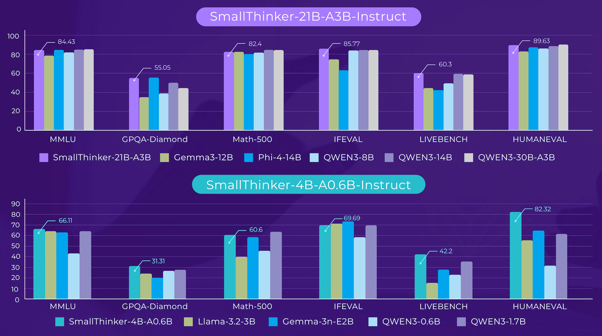

# SmallThinker

<p align="center">
       &nbsp&nbsp🤗 <a href="https://huggingface.co/PowerInfer">Hugging Face</a>&nbsp&nbsp | &nbsp&nbsp🤖 <a href="https://modelscope.cn/organization/PowerInfer">ModelScope</a>&nbsp&nbsp | &nbsp&nbsp 📑 <a href="smallthinker-technical-report.pdf">Technical Report</a> &nbsp&nbsp 
</p>

## 1. Model Introduction

SmallThinker is a family of on-device native Mixture-of-Experts (MoE) language models specially designed for local deployment, co-developed by the IPADS and School of AI at Shanghai Jiao Tong University and Zenergize AI. Designed from the ground up for resource-constrained environments, SmallThinker brings powerful, private, and low-latency AI directly to your personal devices, without relying on the cloud.


### Model Variants
- **SmallThinker-21B-A3B**: The foundation model, a strong start for researchers and builders who want full control for fine-tuning and custom solutions.
- **SmallThinker-4B-A0.6B**: The post-trained model best for drop-in, general-purpose chat and agentic experiences. It is a reflex-grade model without long thinking.

<div align="center">
  <picture>
      
  </picture>
</div>

## 2. Model Summary

<div align="center">

| **Architecture** | **Large MoE Model** | **Small MoE Model** |
|:---:|:---:|:---:|
| **Total Parameters** | 21B | 4B |
| **Activated Parameters** | 3B | 0.6B |
| **Number of Layers** | 52 | 32 |
| **Attention Hidden Dimension** | 2560 | 1536 |
| **MoE Hidden Dimension (per Expert)** | 768 | 768 |
| **Number of Attention Heads** | 28 | 12 |
| **Number of KV Heads** | 4 | 2 |
| **Number of Experts** | 64 | 32 |
| **Selected Experts per Token** | 6 | 4 |
| **Vocabulary Size** | 151,936 | 151,936 |
| **Context Length** | 16K | 32K |
| **Attention Mechanism** | GQA | GQA |
| **Activation Function** | ReGLU | ReGLU |

</div>


## 4. Deployment


### Transformers

`transformers==4.53.3` is required, we are actively working to support the latest version.
The following contains a code snippet illustrating how to use the model generate content based on given inputs.

```python
from transformers import AutoModelForCausalLM, AutoTokenizer
import torch

path = "PowerInfer/SmallThinker-21BA3B-Instruct"
device = "cuda"

tokenizer = AutoTokenizer.from_pretrained(path, trust_remote_code=True)
model = AutoModelForCausalLM.from_pretrained(path, torch_dtype=torch.bfloat16, device_map=device, trust_remote_code=True)

messages = [
    {"role": "user", "content": "Give me a short introduction to large language model."},
]
model_inputs = tokenizer.apply_chat_template(messages, return_tensors="pt", add_generation_prompt=True).to(device)

model_outputs = model.generate(
    model_inputs,
    do_sample=True,
    max_new_tokens=1024
)

output_token_ids = [
    model_outputs[i][len(model_inputs[i]):] for i in range(len(model_inputs))
]

responses = tokenizer.batch_decode(output_token_ids, skip_special_tokens=True)[0]
print(responses)

```

### ModelScope

`ModelScope` adopts Python API similar to (though not entirely identical to) `Transformers`. For basic usage, simply modify the first line of the above code as follows:

```python
from modelscope import AutoModelForCausalLM, AutoTokenizer
```

## Statement
- Due to the constraints of its model size and the limitations of its training data, its responses may contain factual inaccuracies, biases, or outdated information.
- Users bear full responsibility for independently evaluating and verifying the accuracy and appropriateness of all generated content.
- SmallThinker does not possess genuine comprehension or consciousness and cannot express personal opinions or value judgments.

---


## 6. License

Both the code and the model weights are released under the apache 2.0.
